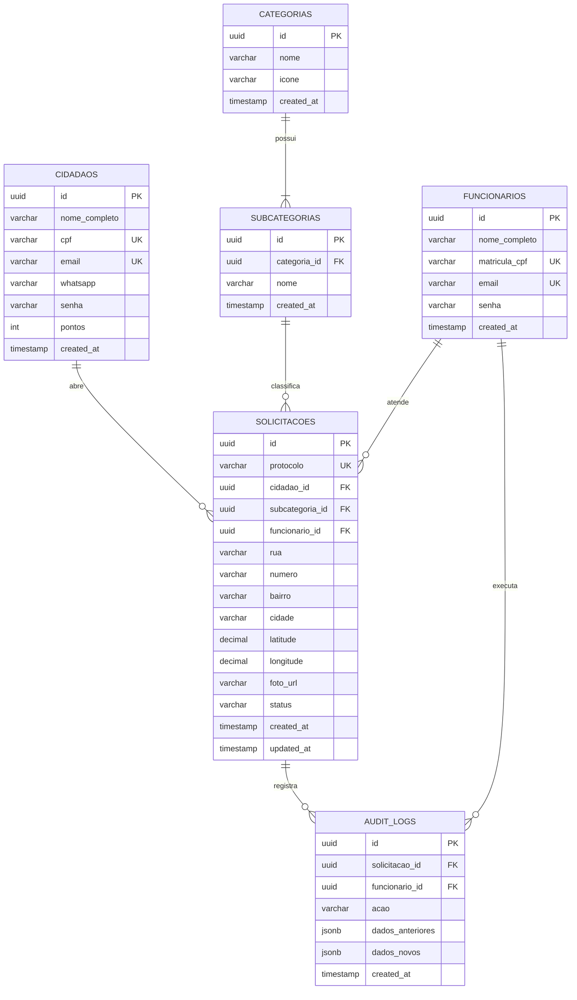

# Diagrama de Entidade-Relacionamento — Banco de Dados ZELUS

## Sobre o Fluxo

O ZELUS possui dois sistemas de acesso independentes: um para **Munícipes** e
outro para **Funcionários da Prefeitura**. A experiência do munícipe é baseada
em **botões de categoria com ícones**, tornando o reporte intuitivo e sem
formulários complexos.

O fluxo central é:

1. **Munícipe cadastra-se e faz login** com e-mail e senha.
2. Seleciona a ocorrência através de **botões de Categoria → Subcategoria**,
   anexa uma foto como evidência e confirma o endereço.
3. O sistema **gera um protocolo único** — o munícipe acumula **pontos** a
   cada solicitação (gamificação).
4. O **Funcionário** recebe a solicitação (inicialmente sem dono), atribui-a e
   atualiza o status. Cada mudança é gravada automaticamente no **Audit Log**.

---

## Diagrama ERD

