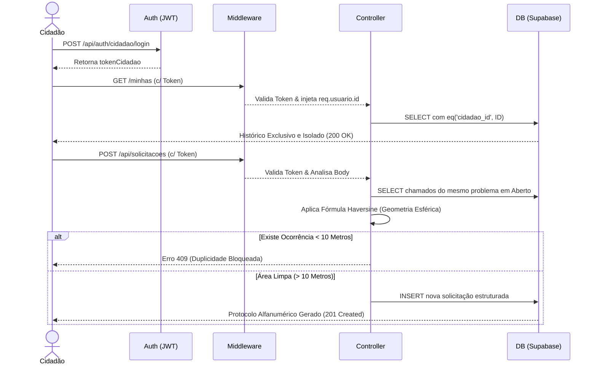
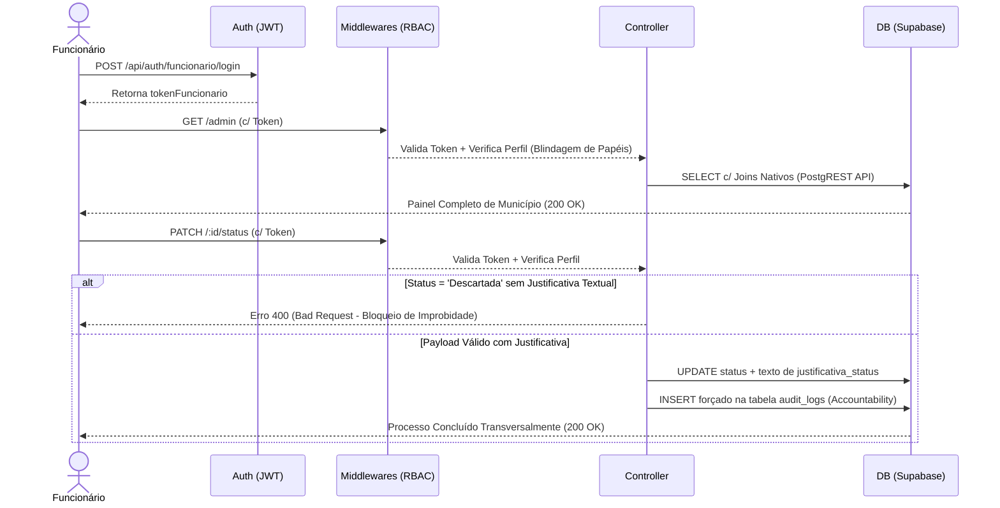

# Dossiê de Arquitetura de Software: Backend ZELUS

---

## 1. Visão Geral e Justificativa do Projeto
O sistema **ZELUS** consiste numa plataforma inteligente orientada para a gestão urbana, desenhada para estreitar a relação entre os munícipes e os órgãos de administração pública. No ecossistema tecnológico contemporâneo, a ineficiência no processamento de requisições públicas (zeladoria urbana) não decorre apenas da morosidade humana, mas frequentemente de limitações arquiteturais dos softwares legados. Tais sistemas falham sistematicamente em identificar redundâncias e em fornecer um rasto fidedigno das ações administrativas.

O backend do ZELUS foi concebido metodologicamente para atuar como o núcleo computacional (motor) da plataforma, capaz de processar chamados em massa de forma resiliente, implementar restrições matemáticas contra o desperdício de recursos (spam) e garantir o pilar fundamental da gestão pública: a transparência e a auditabilidade (Accountability).

---

## 2. Fundamentação do Stack Tecnológico

### 2.1. Node.js e a Arquitetura *Non-Blocking I/O*
A escolha do **Node.js** transcende a mera conveniência linguística de unificar a sintaxe JavaScript entre Frontend e Backend. O Node.js baseia-se no motor V8 do Google Chrome e é guiado pelo padrão **Event-Driven** (Orientado a Eventos) e pela arquitetura **Non-Blocking I/O** (Entrada e Saída não-bloqueante). 

Num contexto de gestão municipal de alta densidade populacional, milhares de cidadãos podem enviar reportes de ocorrências (ex: "buracos na via") simultaneamente durante temporais. Servidores web tradicionais multithreaded (como o Apache clássico) bloqueiam uma *thread* por cada utilizador ativo, saturando rapidamente a memória RAM do servidor. O Node.js, contudo, opera numa única *thread* (*Single Threaded*) regida pelo **Event Loop**. Ao efetuar operações lentas (como gravar imagens ou comunicar com a base de dados), o Node delega o processo para o *Thread Pool* assíncrono do sistema operativo através da biblioteca `libuv` e liberta a *thread* principal para atender o próximo cidadão. Esta abordagem garante que a API do ZELUS não sofra degradação drástica de resposta, mesmo sob picos massivos de utilização simultânea.

### 2.2. Express.js e o Roteamento RESTful
O **Express.js** foi acoplado para providenciar a camada de infraestrutura REST (*Representational State Transfer*). O seu paradigma de desenvolvimento é alicerçado no conceito de *Middlewares* (camadas de interceção). Deste modo, o ciclo de vida de uma requisição HTTP na API flui através de uma corrente de execução sequencial e delegada, onde cada subrotina valida parâmetros antes de permitir que o processador alcance a camada de dados (Controlador).

### 2.3. Supabase, PostgreSQL e PostgREST
Para o armazenamento e cruzamento relacional, adotou-se o modelo *Backend as a Service* (BaaS) através do **Supabase**. No entanto, o seu pilar fundamental não é a base de dados documental, mas sim o robusto motor **PostgreSQL**, que fornece extrema segurança ACID (*Atomicity, Consistency, Isolation, Durability*).

Em projetos comuns de Node.js, é frequente o uso de ORMs (como Sequelize ou Prisma) que provocam lentidão por sobrecarga computacional de abstração na memória do Node. O ZELUS, pelo contrário, apoia-se no padrão **PostgREST**, que atua intrinsecamente na infraestrutura do Supabase. O PostgREST traduz requisições RESTful diretamente para linguagem SQL pura em C, calculando os *Joins* na máquina da base de dados e devolvendo apenas os arrays serializados, o que elimina gargalos de memória na camada do Node.js.

---

## 3. Arquitetura de Segurança e Privacidade

### 3.1. Autenticação *Stateless* com JSON Web Tokens (RFC 7519)
A autenticação do ZELUS não depende do armazenamento clássico de *Sessions* em memória ou ficheiros (como as sessões PHP). Utilizou-se o padrão internacional **JWT (RFC 7519)**, promovendo um modelo *Stateless* (sem estado), o que significa que cada requisição traz em si mesma toda a bagagem de identidade necessária.

A criptografia do JWT está dividida em 3 secções base64Url:
1. **Header:** Define o tipo de token e o algoritmo de criptografia simétrica (ex: `HS256`).
2. **Payload:** O corpo vital. Contém dados *não-sensíveis* publicamente legíveis, como o ID, a função administrativa do utilizador e a data de expiração (Claim `exp`).
3. **Signature:** O núcleo da segurança. É calculada fundindo o Header, o Payload e uma "Chave Secreta" (*Secret Key*) que vive exclusivamente nos ficheiros `.env` do servidor. Qualquer tentativa do cliente de modificar um byte do seu Payload, falsificando o seu ID, invalidará sumariamente a Assinatura Matemática.

### 3.2. Criptografia e a Matemática do *Salting* com Bcrypt
O armazenamento de palavras-passe na gestão pública não permite espaço para erros. O algoritmo escolhido, **Bcrypt**, atua através do conceito do fator de custo computacional iterativo. Ao processar senhas, o Bcrypt gera automaticamente um *Salt* — um vetor de inicialização de *strings* aleatórias que é anexado matematicamente ao texto limpo da senha antes de ser feito o Hash unidirecional. 

Se o sistema armazenasse apenas os Hashes comuns (como SHA-256), atacantes que tivessem acesso ilegal à base poderiam utilizar táticas de **Rainbow Tables** — gigantescas bases de dados de Hashes pré-calculados para senhas comuns ("123456"). O *Salting* destruiu a utilidade do Rainbow Table. Duas pessoas com a exata mesma senha terão Hashes finais na base de dados completamente distintos, inviabilizando ataques de colisão lógica.

### 3.3. Controle de Acesso (RBAC) e *Data Privacy By Design*
O ZELUS erradica ataques da família BOLA (*Broken Object Level Authorization*) também conhecidos como IDOR (*Insecure Direct Object Reference*). Em sistemas amadores, um munícipe mal intencionado poderia inspecionar a URL `GET /api/solicitacoes?user_id=12` e alterar livremente para `user_id=13`, lendo denúncias de terceiros. 

No ZELUS, a extração da identidade é agnóstica às vontades do cliente. A camada de *Middleware* decifra a *Signature* do JWT e expõe o `req.usuario.id`. Quando o cidadão solicita `/minhas`, o Controlador executa o *SELECT* forçando `.eq('cidadao_id', req.usuario.id)`. O tráfego de rede horizontal cruzado torna-se algoritmicamente e fisicamente inalcançável, alinhando a aplicação às exigências extremas da LGPD/GDPR no que toca a proteção de privacidade.

A separação governamental ("Dupla Blindagem") foi estruturada em Controladores de Acesso de Base de Papéis (RBAC). A Rota de Administração (`/admin`) carece de um segundo filtro (`verificarFuncionario`) que examina o Token e encerra prematuramente as requisições (`403 Forbidden`) provenientes de pacotes sem chancela do Município.

---

## 4. Algoritmos Estruturais e Geometria Esférica

### 4.1. Fundamentação Matemática: A Fórmula de Haversine
Um dos desafios capitais para os Municípios é o colapso dos portais por duplicações ("Spam Cidadão"). A API do ZELUS foi instruída para intercetar a tentativa de criação (POST) num raio geográfico local, não permitindo que a mesma tipologia de subcategoria seja registada repetidamente a menos de 10 metros da anterior. 

Para a execução deste cálculo geoespacial, não se pode aplicar a fórmula pitagórica baseada na geometria clássica (Distância Euclidiana: `d = √((x2 - x1)² + (y2 - y1)²)`). As coordenadas globais (Latitude e Longitude) não repousam sobre um plano cartesiano liso em 2D, mas encontram-se mapeadas sobre a superfície curva tridimensional de um esferoide. O uso de Pitágoras resultaria numa tremenda distorção de paralelismo.

A arquitetura socorreu-se, então, da trigonometria esférica de precisão cirúrgica: a **Fórmula de Haversine**. 
A fórmula calcula a "distância de círculo máximo" (*great-circle distance*), concebendo as coordenadas como arcos de um círculo numa esfera cujo raio da Terra ronda os **6371 km**. Ao mapear o diferencial (delta) latitudinal e longitudinal convertidos primariamente para radianos, o cálculo trigonométrico encontra a menor rota transversal possível entre dois pontos da crosta terrestre, despoletando com absoluta confiança o *409 Conflict* caso as duas ocorrências divirjam em menos de 10 metros métricos.

### 4.2. Accountability e a Trilha de Auditoria Imutável
Em consonância com as normas de compliance da Administração Pública, a engenharia estabeleceu uma rotina de *Logging* imutável. No controlador que procede à alteração de Status de um chamado, um INSERT forçado na tabela paralela `audit_logs` é gravado no milissegundo correspondente, perpetuando de forma inviolável a `acao` descritiva, o `id` exato do funcionário que invocou a função, e do chamado que a sofreu. 

### 4.3. Algoritmo Condicional de Descarte (*Guard Clauses*)
A trave-mestra do sistema de responsabilização (accountability) é concretizada no código como um bloqueio preventivo (Guard Clause). Se o status transitório reportar para "Descartada" mas a carga útil (`payload`) omitir a string `justificativa_status`, o código de estado HTTP 400 (`Bad Request`) é subitamente levantado, rechaçando a transação junto do cliente e impossibilitando matematicamente o fecho discricionário mudo e não-transparente por parte do operário autárquico.

---

## 5. Diagramas de Fluxo Operacional (Modelagem do Sistema)

### Fluxo 1: Jornada do Cidadão (Abertura com Interceção Haversine e Leitura Privada)

### Fluxo 2: Jornada do Funcionário (Gestão Transparente e Auditoria Contínua)

---

## 6. Metodologia de Qualidade e Homologação (QA)
A chancela deste ciclo arquitetural baseia-se num paradigma de qualidade comprovada e tangível de Engenharia de Software. Todo o código do sistema CRUD central atravessou **8 Casos de Teste Estruturados (E2E / Integração)** rigorosamente automatizados via script Node.js. 

Estes testes mimetizaram com precisão cibernética os ataques à fronteira (*Boundary Testing*), as falhas intencionais de Token Spoofing e os desvios sub-milimétricos de coordenadas GPS numa modelação real (do município de Pradópolis), obtendo aprovação unânime do comportamento esperado em todas as condições testáveis do espectro de I/O.

---

## 7. Referências Bibliográficas e Tecnológicas

1. **OpenJS Foundation (2024).** *Node.js Documentation.* Retirado da Documentação Oficial, clarificando os princípios estruturais da arquitetura de Concorrência e *Event Loop*. Disponível em: https://nodejs.org/docs
2. **IETF (2015).** *RFC 7519: JSON Web Token (JWT).* The Internet Engineering Task Force. Especificação formal da arquitetura de base para transmissão criptográfica entre entidades isoladas na web.
3. **Sinnott, R. W. (1984).** *"Virtues of the Haversine"*. Sky and Telescope, vol. 68, p. 159. Base teórica e matemática primária justificada no cálculo ótimo das distâncias do círculo máximo, aplicado modernamente nos sistemas GPS e de geolocalização API do ZELUS.
4. **Supabase & PostgREST (2024).** *Supabase Reference Architecture*. Mecanismos de conversão das queries API RESTful para linguagens *Structured Query Language* com máxima fidelidade e latência na camada PaaS. Disponível em: https://supabase.com/docs
5. **Express.js (2024).** *Express Middleware Framework.* Modelo metodológico da requisição em cadeia para API RESTful da Fundação OpenJS. Disponível em: https://expressjs.com/
